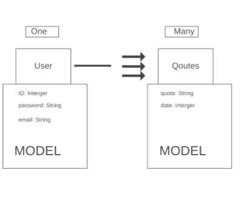
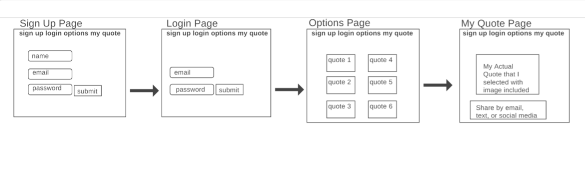

# Project 2 Planning

Fork & Clone this repo.

## Part 1

- [ ] Review the [Project 2 requirements](https://romebell.gitbook.io/seirfx-621/projects/project-2)

- [ ] Check out some [examples](https://romebell.gitbook.io/seirfx-621/projects/past-projects/project2)

- [ ] In this space below, list **THREE** ideas for your Project 2. For each idea, include [user stories](https://www.atlassian.com/agile/project-management/user-stories) for each idea and a link to the API(s) you want to use for it.

--------------------------------------------------------
1. One Quote at a Time (Motivational Quotes) User Story: As a user, I want to be able to easily access motivational quotes based on experience as a traditional or non-traditional student so that I will be encouraged not to give up on my journey.The user will be able to stay on track with studying and joining class by having preset alerts and reminders based on the times when class starts and based on study shedules outside of normal class hours based on the users schedule. 
API Link https://rapidapi.com/hafitkode-iLnzlb6I0uv/api/motivation-api1/
2. Quick Cook Book Guide (Personalized Recipes) User Story: As a user, I want to be able to quickly and easily access recipes of my choice that is based on recipes from anywhere on the web at anytime so that cooking will be hassle free. The recipes will be editable to fit the users dietary, family, and personal needs.  
API Link https://rapidapi.com/mycookbook/api/mycookbook-io1/
4. Now and Then Weather (Real-Time and Historical Weather) User Story: As a user, I will be able to retrieve instant information about weather for the location of my choice. Historical weather information will also be available to identify the tpye of weather that a place historically has had on a specific date overtime.  
API Link https://weatherstack.com/
---------------------------------------------------------

- [ ] Make a PR when you're done!

---

## Part 2

In the space below:
* either embed or link a completed ERD for your approved P2 idea
* if there are any changes/additions to your user stories, place your full set of revised user stories here
* either embed or link wireframes for every page of your app

----------------------------------------------------------
### ERD


----------------------------------------------------------
### User Stories
One Quote at a Time (Motivational Quotes) User Story: As a user, I want to be able to easily access motivational quotes based on my current life experience so that I will be encouraged not to give up on my journey.The user will be able to stay on track by having preset alerts and reminders as well as a weekly calendar of all the quotes used each day. 
API Link https://rapidapi.com/hafitkode-iLnzlb6I0uv/api/motivation-api1/

----------------------------------------------------------
### Wireframes


----------------------------------------------------------

Make a PR when you're done!


## Requirements Inside `Project Board`

`card` FUNDAMENTALS
```
### FUNDAMENTALS
- [ ] Deployed (e.g. Heroku)
- [ ] Site has basic functionality related to its goal
- [ ] At least 2 GET routes (other than auth)
- [ ] At least 1 POST route
- [ ] At least 1 DELETE route
- [ ] At least 1 PUT route
```

`card` SUFFICIENT DIFFICULTY
```
### SUFFICIENT DIFFICULTY: At least 1 of the following: 
- [ ] Use of an API
- [ ] Advanced Database Relationships
- [ ] Sockets
- [ ] Scraping
- [ ] OAuth
- [ ] Other
```

`card` AUTH/SECURITY

```
### AUTH/SECURITY (Mostly From Template Boilerplate)
- [ ] Log in works (required: boilerplate or better)
- [ ] Sensible error messages for bad login info  (boilerplate or better)
- [ ] Passwords hashed in database
- [ ] Passwords in form are input type="password" (dots)
- [ ] Password verification is checked
- [ ] Can't sneak edit/delete data that I don't own by typing in random ids
```
`card` GITHUB USAGE
```
### GITHUB USAGE
- [ ] Appropriate Use of Github
- [ ] `README` is included and is descriptive
- [ ] `.gitignore` properly set up
- [ ] No API keys in Github code (used a .env file)
- [ ] Multiple commits per day
- [ ] Repo up on day 1 of project week or sooner
- [ ] `README` has *Installation Instructions*
```

`card` DATABASE USAGE
```
### DATABASE USAGE
- [ ] At least 2 Models other than join tables (required)
- [ ] Relationships were set up appropriately between models
- [ ] Avoided global variables, storing data in files, etc
- [ ] No raw file/image data stored in database, etc
```

`card` CODE STYLE
```
### CODE STYLE
- [ ] Generally DRY code / No enormous files
- [ ] Proper indentation (or mostly pretty good!)
- [ ] Naming conventions kept
- [ ] No glaring logic errors
```
`card` USER EXPERIENCE
```
- [ ] Effort was put into design
- [ ] No broken links (server errors or 404s)
- [ ] Typing a purposely bad link renders an error 
```
`card` ejs page
```
- [ ] Content is responsive to screen size changes
- [ ] No glaring alignment or grid errors
```
`card` INSTALLATION PROCESS
```
- [ ] git clone https://github.com/cmomie/Project_Two.git
- [ ] cd Project-Two
- [ ] npm install
- [ ] touch .env
```

and add inside `card`.env file 
```
- [ ] SECRET_SESSION=ithastobeasecret
```
If there is an API KEY go to said website and get an API KEYput this inside of their `card` .env file
```
- [ ] API_KEY=......
```
create a database
`card`
```
- [ ] npm install sequelize-cl
- [ ] npx sequelize-cli db:migrate quote
`card`
```
migrate their database
`card`
```
- [ ] npx sequelize-cli db:migrate
```
if they need to seed data
`card`
```
- [ ] npx sequelize-cli db:seed:all
```
start the server
```
- [ ] npm start
```


